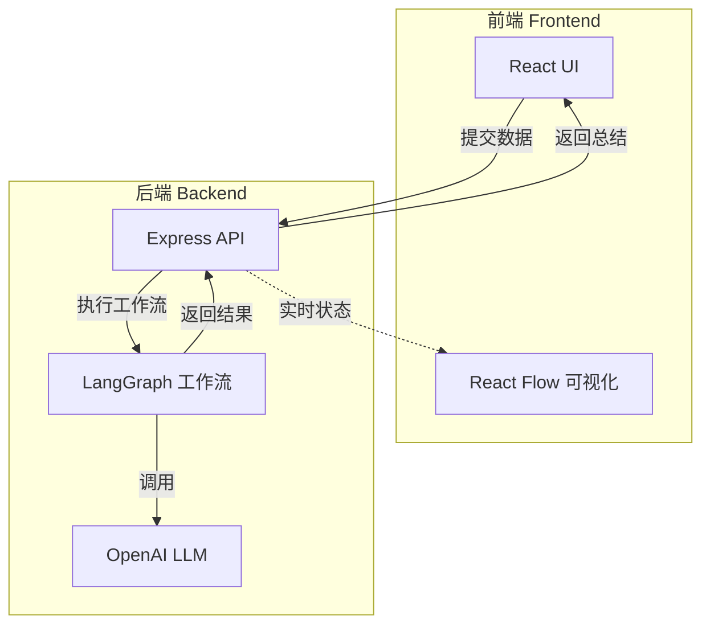

# Recaply - 简化架构

> **目标**: 使用 LangGraph 1.0 + TypeScript 构建一个简单的每日工作总结工具  
> **技术栈**: LangGraph + React + TypeScript

---

## 🎯 核心功能

1. **数据输入**: 手动输入今天的工作内容(GitHub commits、完成的任务、笔记等)
2. **AI 处理**: 使用 LangGraph 工作流处理和分析数据
3. **生成总结**: 自动生成结构化的工作总结
4. **查看结果**: 在前端查看和导出总结

---

## 🏗️ 系统架构



### 🎯 MVP 设计原则

**极简主义**:

- ✅ **轻量级存储** - 使用 SQLite 作为 Checkpointer (单文件数据库)
- ✅ **无用户系统** - 单用户使用
- ✅ **可暂停恢复** - 支持工作流断点续传
- ✅ **执行历史** - 可查看最近的执行记录

**为什么使用 Checkpointer?**

- 🔄 **状态持久化**: 保存每个节点的执行状态
- ⏸️ **暂停/恢复**: 可以暂停工作流,稍后继续
- 🐛 **调试友好**: 可以查看每一步的状态变化
- 📊 **执行历史**: 查看最近的工作流执行记录

**未来可扩展**:

- 📊 迁移到 PostgreSQL (更强大的查询能力)
- 🔐 添加用户认证系统
- 📈 添加数据分析和可视化

---

## 📁 项目结构

```
recaply/
├── backend/                    # 后端服务
│   ├── src/
│   │   ├── workflow/          # LangGraph 工作流
│   │   │   ├── graph.ts       # 工作流图定义
│   │   │   ├── state.ts       # 状态定义
│   │   │   └── nodes/         # 节点实现
│   │   │       ├── ai-processor.ts
│   │   │       ├── collect-git-commits.ts
│   │   │       ├── export-markdown.ts
│   │   │       └── index.ts
│   │   ├── api/
│   │   │   ├── routes/
│   │   │   │   ├── summary.ts # 总结路由
│   │   │   │   └── repos.ts   # 仓库路由
│   │   │   └── server.ts      # Express 服务器
│   │   └── lib/
│   │       ├── git.ts         # Git 操作
│   │       └── logger.ts      # 日志工具
│   ├── package.json
│   ├── tsconfig.json
│   └── .env                   # 环境变量 (不提交到 Git)
│
├── frontend/                   # 前端应用
│   ├── src/
│   │   ├── components/
│   │   │   ├── ui/            # shadcn/ui 组件
│   │   │   ├── InputForm.tsx  # 输入表单
│   │   │   └── ResultCard.tsx # 结果展示
│   │   ├── lib/
│   │   │   └── utils.ts       # 工具函数
│   │   ├── App.tsx
│   │   ├── main.tsx
│   │   └── index.css
│   ├── components.json        # shadcn 配置
│   ├── package.json
│   ├── vite.config.ts
│   ├── tailwind.config.js
│   ├── eslint.config.js       # ESLint 配置
│   └── tsconfig.json
│
├── package.json               # 根 package.json (pnpm workspace)
├── pnpm-workspace.yaml        # pnpm workspace 配置
├── .gitignore
├── README.md
├── ARCHITECTURE.md            # 架构文档
└── CLAUDE.md                  # 开发指南
```

---

## 🔧 LangGraph 工作流设计

### 工作流图


### 状态定义

```typescript
// 工作流状态
interface WorkflowState {
  // 原始输入
  rawInput: {
    commits: string; // GitHub commits
    tasks: string; // 完成的任务
    notes: string; // 其他笔记
  };

  // 处理后的数据
  parsed: {
    commitList: string[];
    taskList: string[];
    noteList: string[];
  };

  // 分类结果
  classified: {
    achievements: string[];
    challenges: string[];
    learnings: string[];
  };

  // 最终总结
  summary: string;
}
```

### 节点实现

**1. 解析节点**: 将原始输入解析成结构化数据  
**2. 分类节点**: 使用 LLM 将内容分类  
**3. 分析节点**: 提取关键信息和洞察  
**4. 生成节点**: 生成最终的总结文本  
**5. 格式化节点**: 格式化为 Markdown

---

## 💻 前端界面

### 页面布局

```
┌─────────────────────────────────────────┐
│  📝 Recaply                             │
├─────────────────────────────────────────┤
│                                         │
│  输入今天的工作内容:                      │
│                                         │
│  GitHub Commits:                        │
│  ┌─────────────────────────────────┐   │
│  │ feat: 实现用户登录功能            │   │
│  │ fix: 修复数据加载 bug            │   │
│  └─────────────────────────────────┘   │
│                                         │
│  完成的任务:                             │
│  ┌─────────────────────────────────┐   │
│  │ - 完成 API 文档                  │   │
│  │ - 代码审查 3 个 PR               │   │
│  └─────────────────────────────────┘   │
│                                         │
│  其他笔记:                               │
│  ┌─────────────────────────────────┐   │
│  │ 今天学习了 LangGraph...          │   │
│  └─────────────────────────────────┘   │
│                                         │
│  [生成总结]                              │
│                                         │
├─────────────────────────────────────────┤
│  工作总结:                               │
│  ┌─────────────────────────────────┐   │
│  │ ## 今日工作总结                  │   │
│  │                                 │   │
│  │ ### 主要成就                    │   │
│  │ - 实现了用户登录功能...          │   │
│  │                                 │   │
│  │ ### 遇到的挑战                  │   │
│  │ - 数据加载性能问题...            │   │
│  └─────────────────────────────────┘   │
│                                         │
│  [复制] [导出 Markdown]                 │
└─────────────────────────────────────────┘
```

---

## 🛠️ 技术栈

### 前端

- **包管理器**: pnpm
- **框架**: React 18 + TypeScript
- **构建工具**: Vite
- **UI 组件**: shadcn/ui (基于 Radix UI)
- **样式**: Tailwind CSS
- **工作流可视化**: React Flow (可选,展示工作流执行动画)
- **HTTP 客户端**: fetch API

### 后端

- **运行时**: Node.js 20+
- **语言**: TypeScript
- **Web 框架**: Express
- **工作流引擎**: LangGraph 1.0 (@langchain/langgraph)
- **Checkpointer**: @langchain/langgraph-checkpoint-sqlite
- **数据库**: SQLite (单文件,零配置)
- **LLM**: @langchain/openai
- **环境变量**: dotenv

### 为什么选择这些技术?

#### SQLite + Checkpointer

**为什么使用 SQLite?**

- ✅ **零配置**: 单个文件,无需安装数据库服务
- ✅ **轻量级**: 完美适合单用户场景
- ✅ **Checkpointer 支持**: LangGraph 原生支持
- ✅ **易于迁移**: 未来可轻松迁移到 PostgreSQL

**Checkpointer 的作用**:

```typescript
// 每个节点执行后自动保存状态
const checkpointer = SqliteSaver.fromConnString("./checkpoints.db");
const graph = workflow.compile({ checkpointer });

// 可以暂停和恢复工作流
await graph.invoke(input, {
  configurable: { thread_id: "daily-summary-2024-12-10" },
});
```

**核心功能**:

- 🔄 **状态持久化**: 每个节点执行后保存状态
- ⏸️ **暂停/恢复**: 工作流可以暂停,稍后继续
- 🐛 **调试**: 查看每一步的状态变化
- 📊 **历史记录**: 查看最近的执行记录
- 🔁 **重试**: 失败后可以从断点重试

**什么时候需要 PostgreSQL?**

- 👥 多用户并发访问
- 📈 复杂的数据分析查询
- 🔐 需要高级权限控制
- ☁️ 云端部署

#### React Flow

- ✅ **可视化**: 实时展示工作流执行状态(可选功能)
- ✅ **用户体验**: 让用户看到 AI 的处理过程
- ✅ **美观**: 专业的节点和边渲染

#### shadcn/ui

- ✅ **现代化**: 美观的 UI 组件
- ✅ **可定制**: 完全控制组件代码
- ✅ **TypeScript**: 完整的类型支持
- ✅ **无依赖**: 直接复制到项目中,不是 npm 包

---

## 🚀 快速开始

### 1. 安装依赖

```bash
# 使用 pnpm 安装所有依赖
pnpm install
```

### 2. 配置环境变量

```bash
# 在 backend 目录创建 .env 文件
cd backend
cp .env.example .env
# 编辑 .env,添加你的 OpenAI API Key
# OPENAI_API_KEY=sk-...
```

### 3. 启动后端

```bash
cd backend
pnpm dev
# 运行在 http://localhost:3000
```

### 4. 启动前端 (新终端)

```bash
cd frontend
pnpm dev
# 运行在 http://localhost:5173
```

### 5. 开始使用

1. 打开浏览器访问 http://localhost:5173
2. 输入今天的工作内容
3. 点击"生成总结"
4. 查看 AI 生成的工作总结
5. 复制或下载 Markdown 文件

---

## 📝 API 设计

### POST /api/summarize

生成工作总结

**请求**:

```json
{
  "commits": "feat: 实现登录\nfix: 修复 bug",
  "tasks": "完成 API 文档\n代码审查",
  "notes": "学习了 LangGraph"
}
```

**响应**:

```json
{
  "threadId": "daily-summary-2024-12-10",
  "summary": "## 今日工作总结\n\n### 主要成就\n...",
  "executionTime": 3500,
  "status": "completed"
}
```

### GET /api/history

获取最近的执行历史

**响应**:

```json
{
  "executions": [
    {
      "threadId": "daily-summary-2024-12-10",
      "timestamp": "2024-12-10T14:30:00Z",
      "status": "completed",
      "duration": 3500
    }
  ]
}
```

### GET /api/history/:threadId

获取特定执行的详细信息和状态

**响应**:

```json
{
  "threadId": "daily-summary-2024-12-10",
  "status": "completed",
  "states": [
    { "node": "parse", "status": "completed", "timestamp": "..." },
    { "node": "classify", "status": "completed", "timestamp": "..." }
  ],
  "result": "..."
}
```

---

## 🎯 MVP 功能范围

### ✅ 包含的功能

- ✅ 手动输入工作内容 (commits、tasks、notes)
- ✅ LangGraph 工作流处理
- ✅ AI 生成结构化总结
- ✅ Checkpointer 支持 (状态持久化)
- ✅ 执行历史查询 (查看最近的总结)
- ✅ 暂停/恢复工作流 (可中断和继续)
- ✅ 实时查看处理进度 (React Flow 可视化)
- ✅ 查看和复制结果
- ✅ 导出 Markdown 文件
- ✅ 美观的 UI (shadcn/ui)

### ❌ 暂不包含 (未来可扩展)

- ❌ 用户认证系统 (单用户使用)
- ❌ 自动数据收集 (GitHub API 等)
- ❌ 数据分析和趋势图表
- ❌ 多用户支持
- ❌ 云端同步

---

## 🔮 未来扩展

### 阶段 1: 数据持久化

1. **添加数据库**: PostgreSQL + Prisma
2. **历史记录**: 保存和查询历史总结
3. **用户系统**: 多用户支持和认证

### 阶段 2: 自动化

4. **数据源集成**: 自动从 GitHub、Todoist 等收集数据
5. **定时任务**: 每天自动生成总结
6. **通知系统**: 邮件或消息推送

### 阶段 3: 高级功能

7. **模板系统**: 自定义总结模板
8. **周报/月报**: 基于历史数据生成
9. **数据分析**: 工作趋势图表和洞察
10. **AI 优化**: 根据历史数据优化总结质量

---

## 📦 依赖清单

### Backend

```json
{
  "dependencies": {
    "@langchain/langgraph": "^0.0.x",
    "@langchain/langgraph-checkpoint-sqlite": "^0.0.x",
    "@langchain/openai": "^0.0.x",
    "express": "^4.18.x",
    "cors": "^2.8.x",
    "dotenv": "^16.0.x"
  },
  "devDependencies": {
    "typescript": "^5.0.x",
    "@types/node": "^20.0.x",
    "@types/express": "^4.17.x",
    "tsx": "^4.0.x"
  }
}
```

### Frontend

```json
{
  "dependencies": {
    "react": "^18.2.x",
    "react-dom": "^18.2.x"
  },
  "devDependencies": {
    "typescript": "^5.0.x",
    "@types/react": "^18.2.x",
    "@types/react-dom": "^18.2.x",
    "@vitejs/plugin-react": "^4.0.x",
    "vite": "^5.0.x"
  }
}
```

---

这是一个**最小可行版本**,专注于核心功能,后续可以根据需求逐步扩展! 🚀
