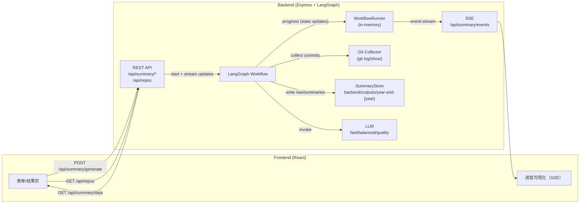

# Recaply

基于 LangGraph + React + TypeScript 的智能工作总结工具（支持日/周/月/年）。

## ✨ 功能特性

- 🤖 **AI 驱动**：使用 LangGraph 工作流 + LLM 生成结构化总结
- 📊 **Git 驱动**：自动收集仓库提交记录，支持仓库选择与作者过滤
- 🗓️ **多粒度总结**：Daily / Weekly / Monthly / Yearly 一键生成
- 📝 **Markdown 导出**：生成结构化的 Markdown 格式总结
- 🧭 **统一看板**：日/周/月/年内容统一浏览（含活动热力图）
- 🎨 **现代化 UI**：基于 shadcn/ui 的界面
- ⚡ **实时反馈**：通过 SSE 实时展示工作流执行进度

## 🚀 快速开始

### 环境要求

- Node.js 20+
- pnpm 8+
- Git
- OpenAI-compatible API Key

### 安装

```bash
# 克隆项目
git clone <repository-url>
cd recaply

# 安装依赖
pnpm install
```

### 配置

在 `backend` 目录创建 `.env` 文件：

```bash
# ===== LLM 配置（必需，至少配置一组可用）=====
# 通用 fallback（当某个 tier 未配置时使用）
OPENAI_API_KEY=sk-...
OPENAI_BASE_URL=https://api.openai.com/v1
AI_MODEL_NAME=gpt-4o-mini

#（可选）按任务类型分层配置模型：fast(日报) / balanced(周报) / quality(月报/年报)
AI_MODEL_FAST=gpt-4.1-mini
AI_BASEURL_FAST=https://api.openai.com/v1
AI_APIKEY_FAST=sk-...

AI_MODEL_BALANCED=gpt-4o-mini
AI_BASEURL_BALANCED=https://api.openai.com/v1
AI_APIKEY_BALANCED=sk-...

AI_MODEL_QUALITY=gpt-4o
AI_BASEURL_QUALITY=https://api.openai.com/v1
AI_APIKEY_QUALITY=sk-...

# ===== Git 仓库扫描（可选）=====
# /api/repos 默认扫描根目录（也可通过 query.rootPath 覆盖）
PROJECTS_ROOT=/path/to/projects
```

### 运行

```bash
# 启动后端（端口 3456）
pnpm dev:backend

# 启动前端（端口 5173）
pnpm dev:frontend
```

访问 http://localhost:5173 开始使用。

## 📁 项目结构

```
recaply/
├── backend/                    # 后端服务
│   ├── src/
│   │   ├── api/               # Express API
│   │   │   ├── routes/        # API 路由
│   │   │   │   ├── summary.ts # 总结/进度/历史接口
│   │   │   │   └── repos.ts   # 仓库扫描接口
│   │   │   └── server.ts      # 服务器入口
│   │   ├── lib/               # 工具库
│   │   │   ├── git.ts         # Git 操作
│   │   │   ├── llm.ts         # LLM 工厂（fast/balanced/quality）
│   │   │   ├── summary-store.ts # summaries/raw 落盘与缓存索引
│   │   │   ├── workflow-runner.ts # SSE 运行态与事件
│   │   │   └── logger.ts      # 日志工具
│   │   └── workflow/          # LangGraph 工作流
│   │       ├── graph.ts       # 工作流图定义
│   │       ├── state.ts       # 状态定义
│   │       └── nodes/         # 工作流节点
│   │           ├── collect-data.ts
│   │           ├── daily-summarizer.ts
│   │           ├── weekly-summarizer.ts
│   │           ├── monthly-summarizer.ts
│   │           ├── year-end-summarizer.ts
│   │           └── persist.ts
│   ├── outputs/               # 生成产物与缓存
│   └── package.json
│
├── frontend/                   # 前端应用
│   ├── src/
│   │   ├── components/        # 业务组件
│   │   │   ├── Dashboard.tsx
│   │   │   ├── SettingsDialog.tsx
│   │   │   ├── GenerationPreview.tsx
│   │   │   ├── ResultCard.tsx
│   │   │   ├── YearEndContainer.tsx
│   │   │   ├── YearEndGenerator.tsx
│   │   │   ├── UnifiedBoard.tsx
│   │   │   ├── unified-board/ # 日/周/月/年统一看板
│   │   │   └── ui/            # shadcn/ui 组件
│   │   ├── hooks/             # 前端状态与数据获取
│   │   │   ├── SummaryContext.tsx  # SSE + 数据接口封装
│   │   │   └── useSettings.tsx     # 仓库/作者设置（localStorage）
│   │   ├── lib/               # 前端工具函数
│   │   │   └── date-utils.ts
│   │   ├── App.tsx
│   │   └── main.tsx
│   └── package.json
│
├── package.json               # Workspace 配置
├── pnpm-workspace.yaml        # pnpm workspace
├── ARCHITECTURE.md            # 架构文档
└── CLAUDE.md                  # 开发指南
```

## 🛠️ 技术栈

### 后端

- **运行时**：Node.js + TypeScript
- **Web 框架**：Express
- **工作流引擎**：LangGraph 1.x（@langchain/langgraph）
- **LLM 接入**：@langchain/openai（支持 OpenAI-compatible BaseURL；支持 fast/balanced/quality 分层模型）
- **数据落盘**：文件系统（`backend/outputs/year-end-{year}/`，包含 raw/daily/weekly/monthly 与 `index.json` 缓存索引）
- **实时进度**：SSE（`/api/summary/events`）+ 内存态 `WorkflowRunner`

#### 后端接口（对外）

- `GET /api/repos?rootPath=...`：扫描目录下的 Git 仓库（默认使用 `PROJECTS_ROOT`）
- `POST /api/summary/generate`：启动生成任务（后台执行）
  - body：`{ selectedRepos: string[], since: string, until: string, summaryType: "daily"|"weekly"|"monthly"|"yearly", author?: string, year?: number }`
  - 返回 `409` 表示已有任务在运行
- `GET /api/summary/events?year=2025`：SSE 实时事件流（`status` / `progress` / `complete` / `workflow_error`）
- `GET /api/summary/data?type=daily|weekly|monthly|yearly&year=2025[&repo=xxx]`：读取已生成内容
- `POST /api/summary/regenerate`：对指定条目重新生成（支持 `customPrompt`；daily 需要额外传 `repo`）
- `GET /api/summary/status?year=2025` / `POST /api/summary/reset`：查看/重置运行态

#### 后端架构图（当前实现）



### 前端

- **框架**：React 18 + TypeScript
- **构建工具**：Vite
- **UI 组件**：shadcn/ui (Radix UI)
- **样式**：Tailwind CSS
- **Markdown 渲染**：react-markdown
- **动画**：framer-motion
- **通知**：sonner
- **日期处理**：date-fns

## 📖 使用说明

### 快速模式

1. 打开右上角 Settings，配置 Git Author + 选择仓库（支持扫描目录下的 git 仓库）
2. 在 Dashboard 选择生成类型：Daily / Weekly / Monthly / Yearly
3. 在预览弹窗确认时间范围与仓库范围后开始生成
4. 生成过程通过 SSE 实时展示进度与日志（年报会显示分阶段步骤）
5. 生成完成后可复制/下载 Markdown，或输入额外指令进行 Regenerate

### 配置管理

- 当前版本不依赖 `config.json`：仓库与作者信息保存在浏览器 `localStorage`（`ye_selected_repos` / `ye_author`）
- 生成结果由后端写入 `backend/outputs/year-end-{year}/`，前端通过 `/api/summary/data` 读取并在 Unified Board 中统一浏览

## 🔧 开发

### 可用脚本

```bash
# 开发
pnpm dev:backend      # 启动后端开发服务器
pnpm dev:frontend     # 启动前端开发服务器

# 构建
pnpm build            # 构建所有项目

# 清理
pnpm clean            # 清理构建产物和临时文件

# 代码检查（frontend）
pnpm --filter recaply-frontend lint
```

### 工作流架构

LangGraph 工作流包含以下节点：

1. **setup**：初始化 `SummaryStore`（创建输出目录、加载/创建 `index.json`）
2. **collect_data**：扫描所选仓库的 Git 提交（按 `date + repo` 聚合，写入 `raw/`）
3. **daily_phase**：对每个 `date + repo` 并行生成日报（缓存命中则跳过）
4. **weekly_phase**：按周聚合日报生成周报（缓存命中则跳过）
5. **monthly_phase**：按月聚合日报生成月报（缓存命中则跳过）
6. **yearly_summarizer**：基于月报（+ 周报细节）生成年终 Self Review
7. **persist**：收尾落盘（保证生成结果写入 `outputs/`）

其中 `summaryType = daily | weekly | monthly | yearly` 决定工作流会在哪个阶段提前结束。

## 📄 许可证

ISC

## 🤝 贡献

欢迎提交 Issue 和 Pull Request！

---

更多详细信息请参阅 [ARCHITECTURE.md](./ARCHITECTURE.md) 和 [CLAUDE.md](./CLAUDE.md)。
